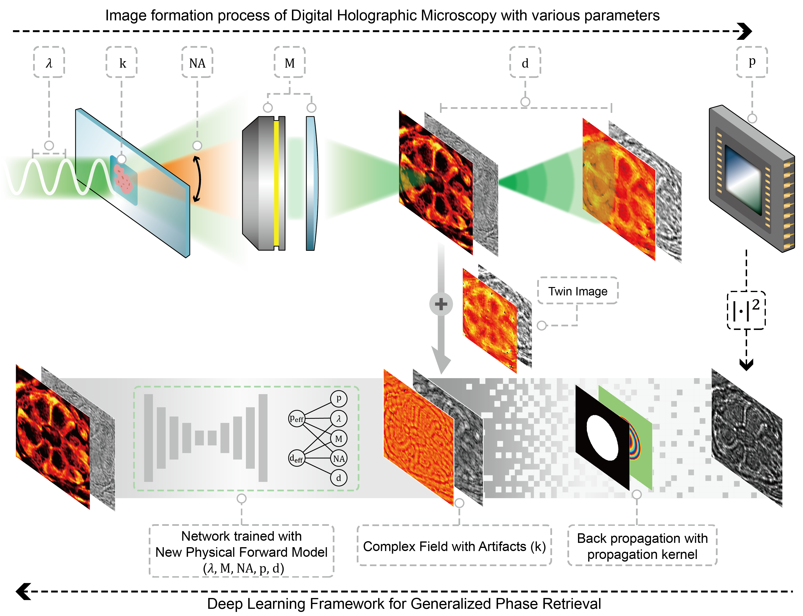

# Generalization of deep learning based holographic reconstruction for histopathology


<div align=center>	
We provide pytorch(python) implementations of <b>Generalization of deep learning based holographic reconstruction for histopathology</b>.
<br>
<br>
This code was written by <b>Jiseong Barg</b>.
<br>
<br>
Last update: 2024.09.04
</div>


# Overview

Holographic microscopy has become a vital tool in the field of life sciences, offering detailed, label-free morphological imaging at the wavelength scale,
with simpler and more practical setups compared to traditional interferometric systems.
 However, conventional phase retrieval methods encounter challenges such as instability, noise sensitivity, and data redundancy. 
 While deep learning (DL)-based approaches have demonstrated superior performance, they remain constrained by the out-of-distribution (OOD) problem.
 Here, we propose a novel DL-based holographic reconstruction method integrating back-propagation and a refined forward model with effective parameterization to overcome OOD problem.
 By leveraging back-propagation and reparameterization, the proposed method enhances both shape and system adaptability, facilitating reliable phase reconstruction across diverse configurations.
 Validation with limited training data from rectum tissue demonstrated robust phase reconstruction performance across various configuration, even with the cancerous rectum tissue,
 underscoring the method's adaptability to OOD data and its potential for clinical and research applications.
 


 

# Environment requirements

The codes was tested on Windows 10 with Python and PyTorch. Packages required to reproduce the results can be found in `requirements.txt`.
The following software / hardware is tested and recommended:

* Python >= 3.9
* CUDA 11.8
* cuDNN 8.4.1
* Intel i5-11400
* Nvidia RTX3080 Ti
* RAM >= 80 GB

# Test

To test the baseline and proposed methods and reproduce results depicted in figure 5,

please follow these steps:

1. **Download Pretrained Weights**
   - Access the pretrained weights from [Google Drive](https://drive.google.com/drive/folders/1iVlmMHpS6WMewwPyzc2lezP5TVCSHDiJ?usp=sharing).
   - Move the downloaded weights to the directory  `/Train/PretrainedModels`.
  
2. **Select Method and Tissue Type:**
  - Choose the method (`baseline` or `proposed`) and the tissue type (`colon` or `appendix`) for testing.

    These options correspond to the conditions used in Figure 5.

3. **Run the `main_test.py`**
  - Execute the following command in your terminal, replacing the method and tissue type as needed:
   ```
   python main_test.py --methods proposed --tissue_type appendix
   ```

4. **Reconstruction Results**
  - The reconstruction results can be found in the `/Test` directory after the script has completed running.

# Train

The data for training both methods will be available from the corresponding author upon reasonable request.

After downloading the training data, place it in the `/Datasets/train/field directory`.

1. **Select Method:**
  - Choose the method (`baseline` or `proposed`)

2. **Run the `main_train.py`**
   - Execute the following command in your terminal, replacing the method and other hyper-parameters as needed.
   
     The command below utilizes the hyper-parameters used in the paper:
   ```
   python main_train.py --methods proposed --batch_size 16 --iterations 50000 --chk_iter 500 --dist_min 1.353 --dist_max 5.413 --pix_min 0.05 --pix_max 0.25
   ```
   
3. **Training Results**
  - The results from the training process will be saved in the '/Train' directory after the script completes its execution.


